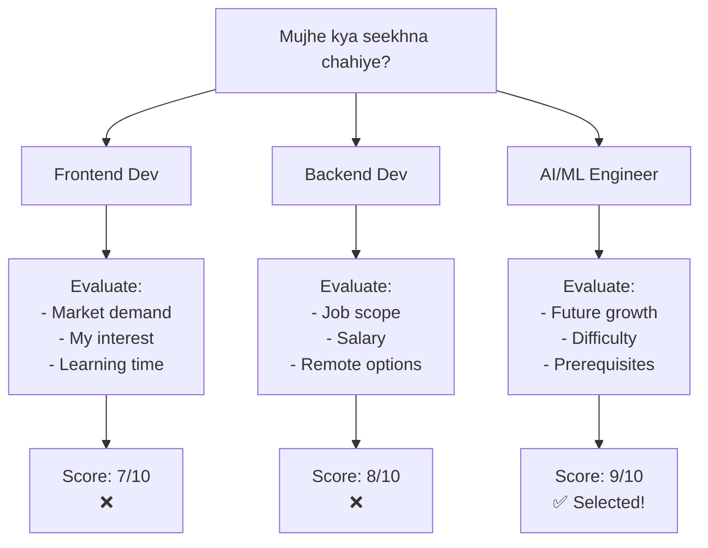

CoT ( Chain Of Thoughts Prompting):
CoT is a sequential reasoning/thinking approach utilized by the LLM (Large Language Model) to get more accurate & precise answers. It breaks down the complex problem into small chunks/ milestones to solve the problem.  

With CoT -> shows Intermediate Steps (Working, Calculation) -> Focused Single Solution Oriented
Without CoT -> Intermediate steps not shown

usecaases when required:
1) Multi-step reasoning 
2) Order of operations
3) Logic chains (if x=y,x=5, z=2,y=?)
4) Transparency Required (working, calculation)
5) for learning Roadmaps
6) Acuuracy and precision matters

Limitations:
1) Increase in computational cost
2) High Latency/Delay for computation
3) Wasteful on small tasks

Keyword: Think Step by Step

Prompt: I want to learn Agentic AI with a clear understanding of how it works in real-world scenarios. Think step by step: First, break down the core principles. Second, outline an effective learning path. Third, suggest practical projects or examples to apply the knowledge.

Example -  Learning RoadMaps

Step 1: Frontend seekho (HTML, CSS, JavaScript)
     ↓
Step 2: Backend seekho (Node.js, databases)
     ↓
Step 3: AI Agents ka concept samjho
     ↓
Step 4: Agentic Workflows implement karo

ToT ( Tree Of Thought Prompting):
ToT is a tree like structure uses by LLM for multiple possible solutions. It uses the Backtracking workflow, evaluation each branch thoroughly and assign it a score. Then, evaluate other branches simultaneously and use odd one out rule. The best solution will be recommended and the others are discarded by LLM for the specific problem. 

ToT -> Multiple Possible Solutions/ Path Oriented

Usecases:
1) Business Decisions
2) Strategic Planning
3) Problem Solving
4) Brainstorming & Mind Mapping
5) Task Decomposition
6) Precision & Accuracy
7) Quality > Speed (Trade-Off)

Limitations:
1) Expensive Computational Cost
2) 50% Latency/Delay > CoT
3) Overthinking Issues

Keyword: Think Multiple approaches/Solutions

Prompt: I want to plan my career path using a Tree of Thoughts approach. Think 3 approaches for: First, assess my strengths, interests, and transferable skills. Second, map market opportunities and future demand. Third, propose three distinct career paths (e.g., technical, managerial, entrepreneurial) with pros, cons, and a 6-12 month action plan for each.

Example - Career Decision:

